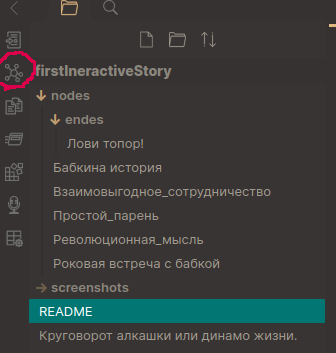

# Это пример написание интерактивного рассказа (Interactive Text Game) 
С терминами и вообще что такое Interactive Text Games можно ознакомиться [вот в этом документе](https://docs.google.com/document/d/1ckahubIW_SVBNAnv93yaYD75iNJW3b6BHZ1Sigx7vDo/edit).
___________________
_Для чтения примера и написания своих рассказов придется ознакомиться с таким инструментом как [Obsidian](https://obsidian.md/) _
____
## Как написать свой интерактивный рассказ
>_Markdown всему голова! [Вот ссылка](https://blog.system-school.ru/2020/08/21/obsidian/) с описанием базовых вещей Markdown в Obsidian_

### Устанавливаем инструмент чтения/написания интерактивной истории
1. Установите на свое устройство ("компутатор") [Obsidian](https://obsidian.md/). Дополнительно:
	- Там можно будет выбрать понятный язык интерфейса, после установки. 
	- Включите основные плагины:
		- Граф.
		- Файловый менеджер.
		- Обратные ссылки.
		- Предварительный просмотр страницы.
		- Палитра команд.
		- Любые другие необходимые лично вам плагины.
	- Установите и включите сторонний плагин Obsidian Git. Для этого придется отключить безопасный режим. Если вы используете ssh-ключи, то нужно будет разблокировать их для Обсидиана. Или использовать некий кэйменеджер.
	- Установите и включите сторонний плагин `languagetool`. Он сильно поможет избежать большинства ошибок в написании текста.
### Читаем пример

1. Через палитру команд находим команду "склонить существующую репу" 
	Пока что клонируем текущию репу, с примером. 
2. 	Открываем файл "Круговорот алкашки или динамо жизни.", который лежит в корне проекта. Это и есть начало рассказа.
3. 	Кусочки истории, ноды, лежат в папке "nodes". 
4. 	Начните читать рассказ с указанного выше файла. Он имеет ссылку на первую ноду рассказа. Пробегитесь по нескольким нодам, используя ссылки внутри них. Это удобнее делать в режиме "просмотр", а не в режиме "редактировать"
5. Обратите внимание, что все ноды связаны между собой. Для просмотра связей удобно использовать "Граф", это слева на панельке 
	
### Создаем свой рассказ	
1. Разумно будет сначала создать репу, в которую будет сохраняться ваше творчество. )))
2. Через палитру команд находим команду "склонить существующую репу" 
3. Теперь смело создавайте первый текстовый файл "новая заметка". Это будет заглавие и краткое описание истории. Этот файл должен лежать в корне репы.
4. Создайте директорию с именем `nodes`. В ней будут храниться все ноды истории.
5. Создайте свою первую ноду. Напишите в ней то, что подходит для начала любой истории, некую затравку, начало завязки.
6. Теперь вернитесь в документ из пункта 3 и создайте там ссылку на свою первую ноду истории из п. 5. Обратите внимание, что ссылка может не работать если в названии путей или файла есть пробелы. Для "лечения" пробелов нужно использовать вставку из символов `&#32;` в самой ссылке вместо пробела. Ну или называйте файлы без использования пробелов.
7. Сравните свое написание имен файлов и ссылок на них с примером.

Вот у вас уже есть история из заглавия и первой ноды. Теперь нужно как-то расширить свой рассказ.

Допишите в первой ноде не только некое повествование, но и перечень выборов, которые предоставляются читателю. Выборы должны быть отделены от основного текста ноды и **пронумерованы**.
Каждый выбор должен приводить (ссылаться) к конкретной следующей или любой предыдущей ноде.