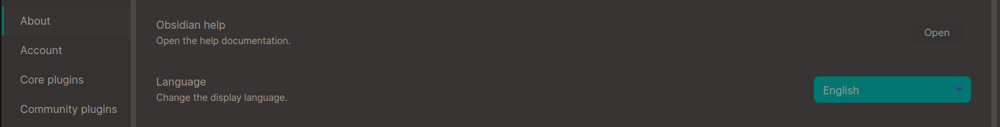

# Это пример написание интерактивного рассказа (Interactive Text Game) 
С терминами и вообще что такое Interactive Text Games можно ознакомиться [вот в этом документе](https://docs.google.com/document/d/1ckahubIW_SVBNAnv93yaYD75iNJW3b6BHZ1Sigx7vDo/edit).
____
## Как написать свой интерактивный рассказ
>_Markdown всему голова! [Вот ссылка](https://blog.system-school.ru/2020/08/21/obsidian/) с описанием базовых вещей Markdown в Obsidian_
1. Возможно стоит вначале создать репу, куда можно будет автоматически сохранять ваши наработки по созданию своего рассказа. Но это пока не обязательно. 
2. Установите на свое устройство ("компутатор") [Obsidian](https://obsidian.md/). Дополнительно:
	- Там можно будет выбрать понятный язык интерфейса, после установки. 
	- Включите основные плагины:
		- Граф.
		- Файловый менеджер.
		- Обратные ссылки.
		- Предварительный просмотр страницы.
		- Палитра команд.
		- Любые другие необходимые лично вам плагины.
	- Установите и включите сторонний плагин Obsidian Git. Для этого придется отключить безопасный режим. Если вы используете ssh-ключи, то нужно будет разблокировать их для Обсидиана. Или использовать некий кэйменеджер.
	- Установите и включите сторонний плагин `languagetool`. Он сильно поможет избежать большинства ошибок в написании текста.
3. Через палитру команд находим команду "склонить существующую репу" (которую вы создали ранее) 
4. Теперь смело создавайте первый текстовый файл "новая заметка". Это будет заглавие и краткое описание истории. Этот файл должен лежать в корне репы.
5. Создайте директорию с именем `nodes`. В ней будут храниться все ноды истории.
6. Создайте свою первую ноду. Напишите в ней то, что подходит для начала любой истории.
7. Теперь вернитесь в документ из пункта 4 и создайте там ссылку на свою первую ноду истории из п. 6. Обратите внимание, что ссылка может не работать если в названии путей или файла есть пробелы. Для "лечения" пробелов нужно использовать вставку из символов `&#32;`, вместо пробела.

Вот у вас уже есть история из заглавия и первой ноды. Теперь нужно как-то расширить свой рассказ.

Допишите в первой ноде не только некое повествование, но и перечень выборов, которые предоставляются читателю. Выборы должны быть отделены от основного текста ноды и **пронумерованы**.
Каждый выбор должен приводить (ссылаться) к конкретной следующей или любой предыдущей ноде.